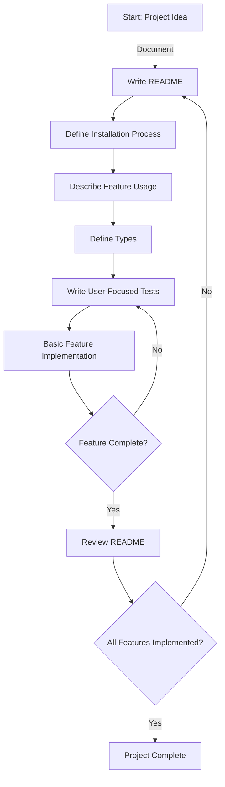

# Project Development Guidelines

## Overview
This document outlines our specific programming methodology designed for efficiency, safety, and clarity. Our approach emphasizes functional programming, Domain-Driven Design (DDD), and a precise development cycle.

## Development Cycle

1. **Project Documentation**: Begin by writing a README that describes the project's purpose and functionality.

2. **Installation Instructions**: Detail the installation process of the project within the README.

3. **Feature Usage Documentation**: In the README, describe how to use the feature you are about to implement.

4. **Type Definition**: Define the types needed for the feature. Align with DDD principles, ensuring that types are named exactly as an end user would describe them. Avoid abstract naming.

5. **User-Focused Testing**: Write tests for the feature, focusing only on the parts that users interact with. Avoid testing non-user-facing functions.

6. **Basic Implementation**: Develop a minimal implementation to make the test pass, without optimizing at this stage.

7. **Iterative Development**: Repeat steps 5 and 6 until the feature works as described in the README. Continue this process for all features outlined in the initial project description, avoiding the addition of new features.

## Programming Approach

- **Functional Programming**: Prioritize a functional programming style, avoiding object-oriented programming (OOP) features and inheritance to maintain simplicity and future code adaptability.

- **Naming Conventions**: Use the format `verb_goal_object_from_start_object` for naming functions. This convention signifies that each function transforms one object type into another. The input and output data should remain immutable, returning a modified copy if changes are necessary.

## Mermaid Diagram

This diagram illustrates the iterative development cycle, emphasizing documentation, testing, and minimal feature implementation.
