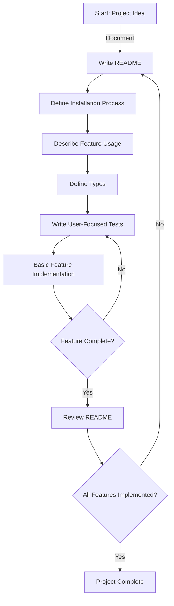

# Project Development Guidelines

## Overview
This document outlines our specific programming methodology designed for efficiency, safety, and clarity. Our approach emphasizes functional programming, Domain-Driven Design (DDD), and a precise development cycle.

## Development Cycle

1. **Project Documentation**: Begin by writing a README that describes the project's purpose and functionality.

2. **Installation Instructions**: Detail the installation process of the project within the README.

3. **Feature Usage Documentation**: In the README, describe how to use the feature you are about to implement.

4. **Type Definition**: Define the types needed for the feature. Align with DDD principles, ensuring that types are named exactly as an end user would describe them. Avoid abstract naming.

5. **User-Focused Testing**: Write tests for the feature, focusing only on the parts that users interact with. Avoid testing non-user-facing functions.

6. **Basic Implementation**: Develop a minimal implementation to make the test pass, without optimizing at this stage.

7. **Iterative Development**: Repeat steps 5 and 6 until the feature works as described in the README. Continue this process for all features outlined in the initial project description, avoiding the addition of new features.

## Programming Approach

- **Functional Programming**: Prioritize a functional programming style, avoiding object-oriented programming (OOP) features and inheritance to maintain simplicity and future code adaptability.

- **Naming Conventions**: Use the format `verb_goal_object_from_start_object` for naming functions. This convention signifies that each function transforms one object type into another. The input and output data should remain immutable, returning a modified copy if changes are necessary.

## Mermaid Diagram

This diagram illustrates the iterative development cycle, emphasizing documentation, testing, and minimal feature implementation.

## Advantages of This Approach Over Others

This programming methodology offers several advantages over traditional approaches, making it ideal for certain types of projects, particularly those requiring clear, functional, and user-centric design. Below are the key benefits:

### Emphasis on Documentation
- **Clear Project Vision and Usage**: Starting with comprehensive documentation ensures that all team members have a clear understanding of the project's purpose, installation process, and feature usage right from the beginning.
- **Improved Onboarding**: New team members can quickly familiarize themselves with the project and its features, leading to a smoother onboarding process.

### Domain-Driven Design (DDD)
- **Enhanced User Relevance**: By naming types and features exactly as end users would, the codebase becomes more intuitive and aligned with user needs, simplifying both development and future maintenance.
- **Reduction in Ambiguity**: Avoiding abstract naming reduces confusion, making it easier for developers to understand and modify the code.

### Test-Driven Development
- **Increased Code Quality**: Writing tests for user-facing features before implementation ensures that the code meets its intended functionality and reduces the likelihood of bugs.
- **Focused Testing**: By testing only user-facing functions, resources are efficiently allocated, focusing on the parts of the code that have the highest impact on user experience.

### Functional Programming
- **Simplified Codebase**: The avoidance of OOP features and inheritance leads to a more straightforward and less complex code structure, which is easier to understand and modify.
- **Immutable Data**: Treating data as immutable and using transformations enhances the predictability and reliability of the code, reducing side-effects and making debugging easier.

### Iterative Development
- **Rapid Feature Delivery**: The cycle of implementing basic functionality and then iterating ensures that features are developed and refined quickly, providing a faster turnaround.
- **Adaptive and Agile**: This approach allows for easier adaptation to changing requirements or user feedback, as each iteration can incorporate new insights.

### Naming Conventions
- **Predictable Functionality**: The `verb_goal_object_from_start_object` naming pattern makes the purpose and effect of functions transparent, facilitating easier understanding and use of the code.
- **Enhanced Code Readability**: Such descriptive naming conventions improve code readability, making it easier for developers to navigate and maintain the codebase.

In summary, this approach fosters a user-centric, agile, and clear coding environment. It's particularly beneficial for projects where user experience, code maintainability, and rapid, iterative development are key priorities.

